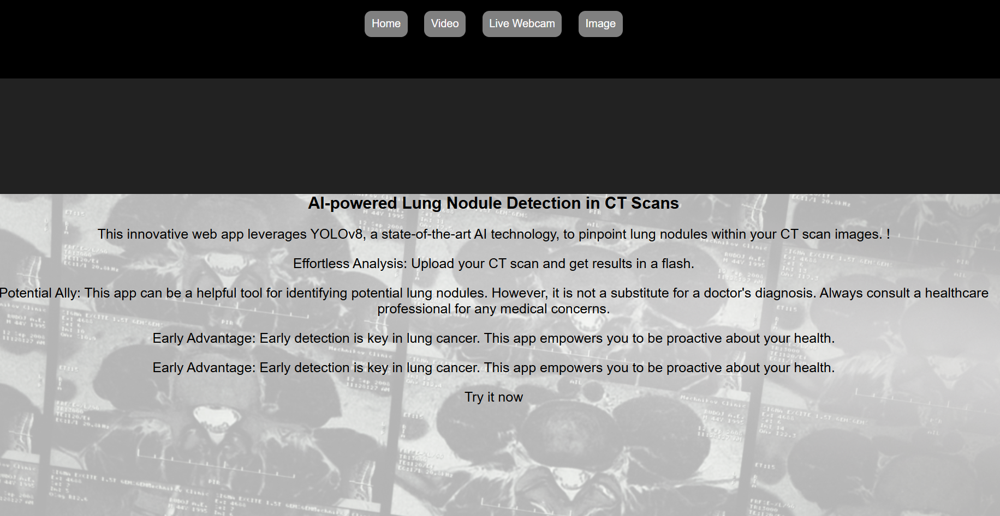
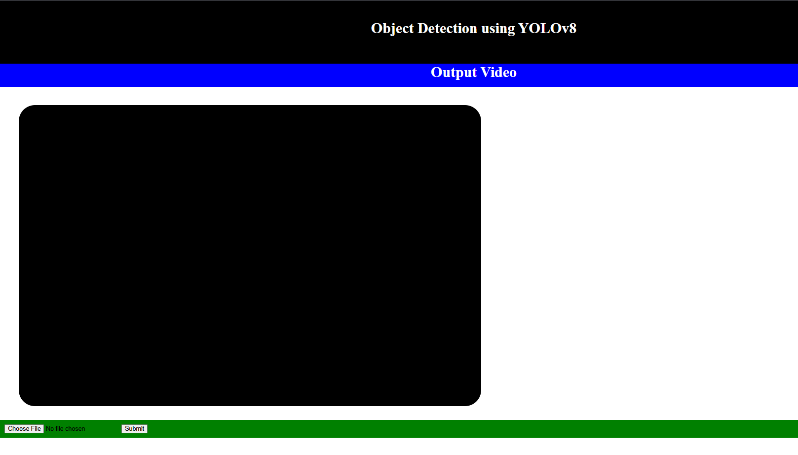

# YOLO Flask WebApp for Real-Time Video and Image Detection

This is a web application built using **YOLO** (You Only Look Once) object detection and **Flask**, designed for real-time detection of objects in both images and video streams.

## Features
- **Image Detection**: Upload an image and the app detects and labels objects using YOLO.
- **Video Detection**: Stream video to the web app for live object detection.
- **Real-Time WebApp Detection**: Use the webcam for real-time detection in your browser.

## Prerequisites
Before running the app, ensure you have the following installed:
- Python 3.x
- Flask
- OpenCV
- YOLOv5 or YOLOv3 weights

## Installation

1. Clone the repository:
   ```bash
   git clone https://github.com/yourusername/yolo-flask-webapp.git
   cd yolo-flask-webapp
   ```

## Example Screenshots


